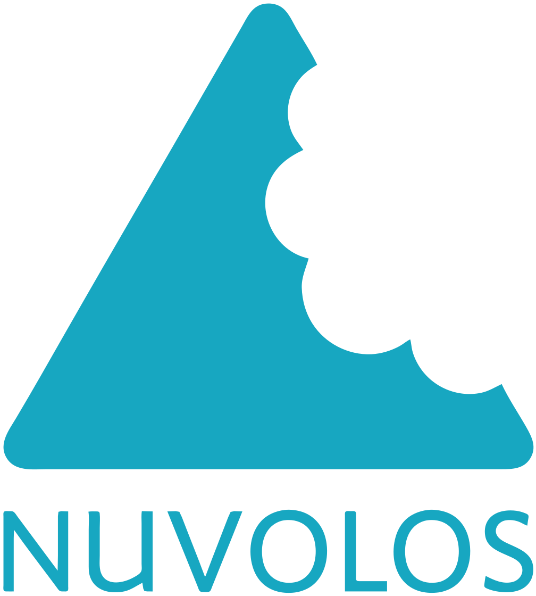

.. image:: https://readthedocs.org/projects/respy-lectures/badge/?version=latest
  :target: https://respy-lectures.readthedocs.io/en/latest/?badge=latest

.. image:: https://github.com/luward/respy-lectures/workflows/Continuous%20Integration/badge.svg
  :target: https://github.com/luward/respy-lectures/actions

.. image:: https://img.shields.io/badge/code%20style-black-000000.svg
  :target: https://github.com/psf/black

.. image:: https://img.shields.io/badge/License-MIT-yellow.svg
  :target: https://opensource.org/licenses/MIT

.. image:: https://img.shields.io/badge/zulip-join_chat-brightgreen.svg
  :target: https://ose.zulipchat.com

respy - lectures
================

This repository contains several lectures that use the ``respy`` package. These support our educational activities around our group's research code.

Powered by
----------

.. image:: lectures/_static/images/OSE_sb_web.svg
  :width: 22 %
  :target: https://open-econ.org

